# CAN

## 目录

- [1.关于CAN](#1关于CAN)
  - [1.1电气特性](#11电气特性)
  - [1.2逻辑电平](#12逻辑电平)
  - [1.3  5种帧](#13--5种帧)
- [2.CAN 控制器](#2CAN-控制器)
  - [2.1波特率](#21波特率)

> 🫒1986 年 2 月， Robert Bosch GmbH 在汽车工程师协会（SAE）大会上推出了控制器局域网（CAN）  串行总线系统。这是有史以来最成功的网络协议之一诞生的时刻。如今，欧洲几乎所有汽车都配备了  至少一个 CAN 网络。 CAN 还用于其他类型的车辆，从火车到轮船，以及工业控制中， CAN 是最主 要的总线协议之一，甚至可能是全球领先的串行总线系统。

经典 CAN 是 1Mbps， CAN FD 最高 2Mbps， CAN FD-SiC 是 5-8Mbps， CAN XL 是 10Mbps。

## 1.关于CAN

> 🫒SO11519定义了通信速率为10～125Kbps的低速CAN通信标准，属于开环总线，传输速率为40Kbps时，总线长度可达1000米；

> 🫒ISO11898定义了通信速率为125Kbps～1 Mbps的高速CAN通信标准，属于闭环总线，传输速率可达1Mbps，总线长度≤40米；

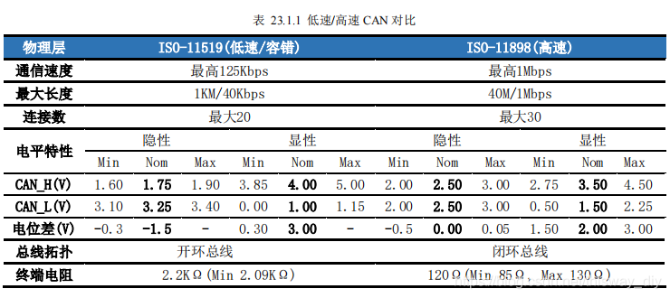

#### 1.1电气特性

> 🫒每个节点设备由CAN控制器和CAN收发器组成，CAN控制器通常作为外设集成在MPU/MCU上，而CAN收发器则需要外围添加芯片电路。

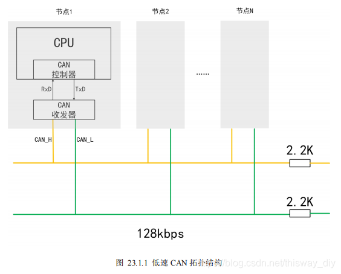

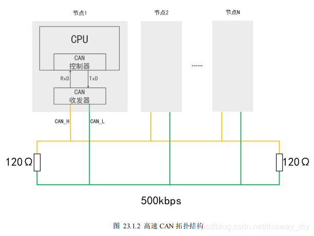

#### 1.2逻辑电平

> 🫒类似RS485，CAN也使用差分信号传输数据。CAN总线使用CAN\_H和CAN\_L的电位差来表示数据电平。电位差分为显性电平和隐性电平，分别表示逻辑0和1。如图 23.1.3 所示，是低速CAN（ISO11519标准）的电平定义，如图 23.1.4 是高速CAN（ISO11898标准）的电平定义，两者物理层电气特性不一样，因此不能将它们连接在一起。可以看到当CAN\_H和CAN\_L电压相近，则表示隐性电平，对应逻辑1，当两个电压相差较大，表示显性电平，对应逻辑0。

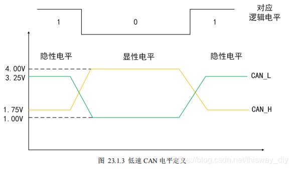

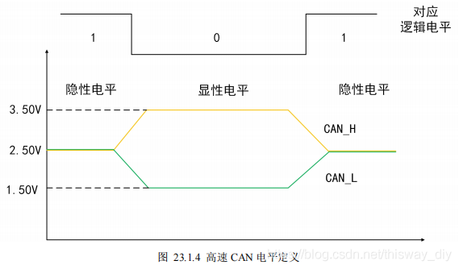

#### 1.3  5种帧

> 🫒CAN总线以“帧”（Frame）的形式进行通信。CAN 总线协议规定了5种帧，分别是**数据帧**、远程帧、错误帧、超载帧以及帧间隔，其中**数据帧**最常用。

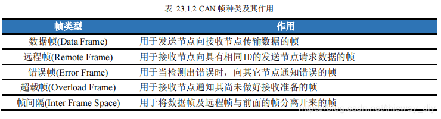

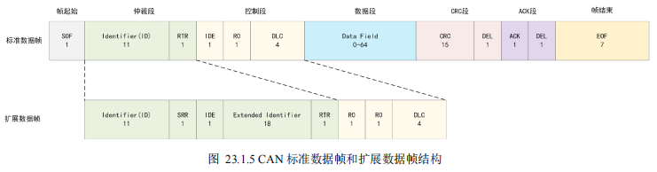

> 🍇帧起始(Start Of Frame-SOF)：1bit，显性信号，表示数据帧（或远程帧）的开始；
> 仲裁段(Arbitration Field)：包括标识符位（Identifier field-ID）和远程发送请求位（Remote Transfer Request，RTR）；

> 🍊标准帧的ID位是11位，即范围是0x000\~0x7FF，而扩展帧的ID是11+18=29位；在CAN协议中，ID决定报文的优先级高低，也决定这拓扑结构的节点是否接收此ID的帧数据；

> 🥕远程发送请求位，用于区分该帧是数据帧还是远程帧，显性信号（0）代表数据帧（Data Frame），隐性信号（1）代表远程帧（Remote Frame）；

> 🍋控制段（Control Field）：标准帧中由扩展标识符位（Identifier Extension bit-IDE，1 bit）、保留位0（Reseved bit0-r0，1 bit）、数据长度编码位（Data Length Code-DLC，4 bits）组成；扩展帧用由两个保留位（Reseved bit，2 bit）、数据长度编码位（Data Length Code-DLC，4 bits）组成;

> 🥑数据段（Data Field）：发送数据的内容，最多8个字节（64bit），它的实际长度会写到前面的数据长度编码位DLC里。

> 🍉循环校验段（CRC Field）：包括循环校验序列（CRC Sequence）和界定符（Delimiter，DEL）；循环校验序列用于校验传输是否正确；界定符用于表示循环校验序列是否结束；

> 🫒确认段（ACK Field）：包括确认位（ACK SLOT）和界定符（Delimiter，DEL）；确认位在节点收到正确的CRC序列时，发送端的ACK位被置位；界定符表示确认是否正常接收；
> 帧结束（End of Frame-EOF）：7位长度，隐性信号，表示帧的结束；

## 2.CAN 控制器

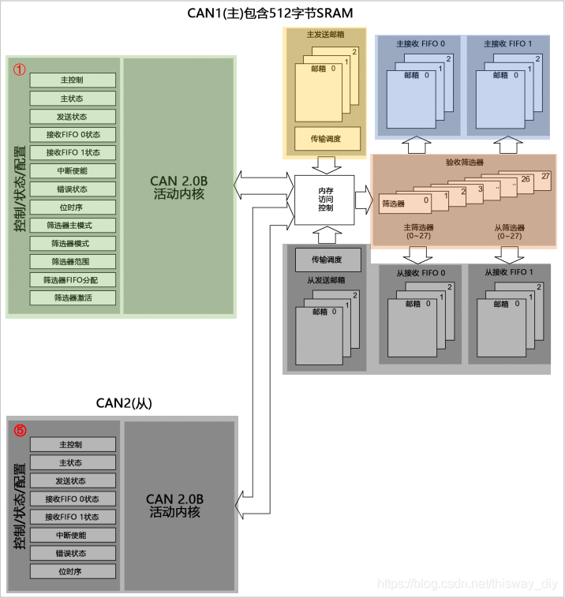

#### 2.1波特率

> 📌CAN采用“位同步”机制，实现对电平的正确采样。传输中的每位数据由四段组成：同步段（Synchronization Segment，SS）、传播时间段（Propagation TimeSegment，PTS）、相位缓冲段1（Phase Buffer Segment 1，PBS1）和相位缓冲段2（Phase Buffer Segment 2， PBS2）。每段又由多个位时序（Time Quantum，Tq）组成，如图 23.1.6 所示，为各段组成示意图。

> 📌同步段（Synchronization Segment，SS） 1tq  = can 频率

> 📌传播时间段（Propagation TimeSegment，PTS）

> 📌相位缓冲段1（Phase Buffer Segment 1，PBS1）

> 📌相位缓冲段2（Phase Buffer Segment 2， PBS2）

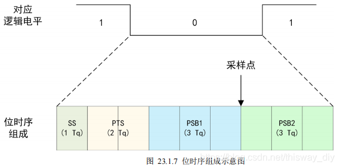

> 🍋假设CAN对应逻辑电平持续的时间为9Tq，即一位数据持续的时间为9Tq。其中SS段长度为1Tq（只能为1Tq），PTS段长度为2Tq（范围为18Tq），PSB1段长度为3Tq（范围为18Tq），PSB2段长度为3Tq（范围为2\~8Tq）。采样点在PSB1和PSB2之间，调整各段的长度，即可对采样点位置进行调整，实现补偿准确采样。

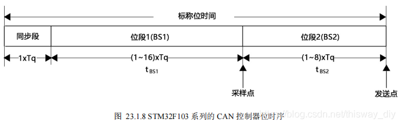

> 🫒如图所示，为STM32F103系列的CAN控制器位时序，和标准CAN协议的位时序略有不同。STM32只有三段，同步段长度为1Tq（只能为1Tq），标准CAN协议中的PTS段和PSB1合并为位段1（范围为1-16Tq），标准CAN协议中的PSB2段对应位段2（范围为1-8Tq）。

波特率计算

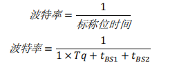

```c 
//---------------------------------------------------------------
    // 初始化CAN, 置相关寄存器，
    //---------------------------------------------------------------
    CAN_InitStructure.CAN_TTCM = DISABLE;
    CAN_InitStructure.CAN_ABOM = ENABLE;
    CAN_InitStructure.CAN_AWUM = DISABLE;
    CAN_InitStructure.CAN_NART = DISABLE;
    CAN_InitStructure.CAN_RFLM = DISABLE;
    CAN_InitStructure.CAN_TXFP = DISABLE;
    CAN_InitStructure.CAN_Mode = CAN_Mode_Normal;
    //---------------------------------------------------------------
    // CAN Baudrate = 125Kbps (CAN clocked at 42 MHz)
    // 42M/(21*(1+14+1)) = 125Kbps
    // CAN_InitStructure.CAN_SJW  = CAN_SJW_1tq;
    // CAN_InitStructure.CAN_BS1  = CAN_BS1_14tq;
    // CAN_InitStructure.CAN_BS2  = CAN_BS2_1tq;
    // CAN_InitStructure.CAN_Prescaler = 21;
    //---------------------------------------------------------------
    CAN_InitStructure.CAN_SJW  = CAN_SJW_1tq;
    CAN_InitStructure.CAN_BS1  = CAN_BS1_14tq;
    CAN_InitStructure.CAN_BS2  = CAN_BS2_1tq;
    CAN_InitStructure.CAN_Prescaler = 21;
```


[CAN的电平状态](https://www.wolai.com/Lq67QitdoQFydZwTNpJSc "CAN的电平状态")

[CAN会监听自发数据](https://www.wolai.com/7tVcK9846sSji4TAVjCNrv "CAN会监听自发数据")

[CAN通信协议应用设计](https://www.wolai.com/2eqraNmtL32zaBsqkfu3rN "CAN通信协议应用设计")

[比亚迪CAN通信](https://www.wolai.com/oyi5aqe8hvvyRQoRh9qodW "比亚迪CAN通信")
